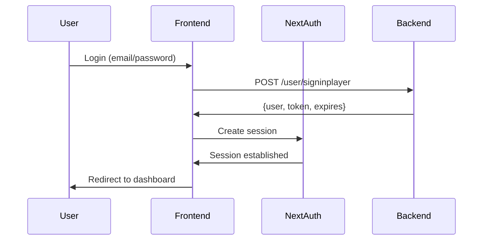

# Backend Architecture Implementation - DEFENDR Frontend Project

## 📋 Table of Contents

1. [Architecture Overview](#architecture-overview)
2. [Core Backend Integration Components](#core-backend-integration-components)
3. [Service Layer Architecture](#service-layer-architecture)
4. [Real-Time Communication](#real-time-communication)
5. [Authentication & Authorization](#authentication--authorization)
6. [API Endpoint Structure](#api-endpoint-structure)
7. [Frontend API Layer Structure](#frontend-api-layer-structure)
8. [Development & Deployment](#development--deployment)
9. [Key Architectural Decisions](#key-architectural-decisions)
10. [Environment Configuration](#environment-configuration)
11. [Security Features](#security-features)
12. [Summary](#summary)

---

## 🏗️ Architecture Overview

### **Architecture Type: Frontend-Only with External API Integration**

This project is a **Next.js frontend application** that doesn't have its own backend server. Instead, it integrates with external backend APIs hosted separately.

**Key Characteristics:**

- **Frontend-First Approach**: No backend code in this repository
- **API Gateway Pattern**: All backend communication through external APIs
- **Service Layer Pattern**: Organized service modules for each domain
- **Authentication Delegation**: NextAuth handles client-side auth, backend manages backend auth

---

## 🔧 Core Backend Integration Components

### 1. **External API Integration**

```typescript
// Primary Backend Service
Production:  https://api.defendr.gg
Development: https://api-dev.defendr.gg
```

**Configuration:**

- **Base URL**: Uses `NEXT_PUBLIC_API` environment variable
- **Environment-aware**: Automatically switches between dev/prod
- **CORS Configuration**: Properly configured for cross-origin requests

### 2. **HTTP Client Architecture**

```typescript
// Centralized HTTP client with features:
src/lib/api/axiosConfig.ts
├── Automatic token injection
├── Error handling & categorization
├── Request/response interceptors
├── Server-side rendering support
├── Authentication requirement flags
└── Request caching and optimization
```

**Key Features:**

- **Token Management**: Automatic Bearer token injection
- **Error Categorization**: SERVER, CLIENT, AUTH, NETWORK, VALIDATION errors
- **Timeout Handling**: 10-second request timeout
- **Instance Caching**: WeakMap-based caching for server requests

---

## 📋 Service Layer Architecture

### **Service Organization Structure**

```
src/services/ (35+ service modules)
├── userService.tsx           # User management & authentication
├── tournamentService.tsx     # Tournament operations & management
├── teamService.tsx          # Team creation, membership, management
├── matchService.tsx         # Match scheduling, results, management
├── organizationService.tsx  # Organization features & settings
├── paymentService.tsx       # Payment processing & transactions
├── payoutService.tsx        # Winner payouts & prize distribution
├── notificationService.tsx  # Real-time notifications & alerts
├── gameService.tsx         # Game-related operations & data
├── messageService.tsx      # Chat & messaging functionality
├── bracketService.tsx      # Tournament bracket management
├── roundService.tsx        # Tournament round management
├── prizeService.tsx        # Prize management & allocation
├── participantService.tsx   # Tournament participant management
├── freeAgentService.tsx    # Free agent marketplace
├── ticketService.tsx       # Support ticket system
├── blogService.tsx         # Content management & blogs
├── feedback.tsx           # User feedback & reviews
├── review.tsx             # Review system
├── chatBot.tsx            # AI chatbot integration
├── screenshotService.tsx   # Screenshot upload & management
├── referralService.tsx     # Referral program management
├── partnerContactService.tsx # Partner relationship management
├── adminService.tsx        # Administrative functions
├── defendrBlueService.tsx  # Premium service features
├── defendrRedService.tsx   # Elite service features
└── Gaming Platform Integrations:
    ├── battleNetService.tsx    # Battle.net integration
    ├── steamService.tsx       # Steam platform integration
    ├── epicGamesService.tsx   # Epic Games integration
    ├── riotGamesService.tsx   # Riot Games integration
    ├── psnService.tsx         # PlayStation Network integration
    └── xboxService.tsx        # Xbox Live integration
```

### **Service Categories & Responsibilities**

#### **Core User Services**

- **User Management**: Authentication, profiles, settings, statistics
- **Social Features**: Friends, followers, friend requests
- **Security**: 2FA, password management, account verification

#### **Tournament & Competition**

- **Tournament Lifecycle**: Creation, registration, execution, completion
- **Bracket Management**: Tournament structure, seeding, progression
- **Match Operations**: Scheduling, results, dispute resolution
- **Participant Management**: Registration, eligibility, verification

#### **Team & Organization**

- **Team Management**: Creation, membership, roles, transfers
- **Organization Features**: Multi-team management, sponsorships
- **Player Marketplace**: Free agents, recruitment, transfers

#### **Gaming Platform Integration**

- **Platform Authentication**: OAuth integration for major platforms
- **Account Linking**: Steam, Battle.net, Epic Games, PlayStation, Xbox
- **Game Data Sync**: Player stats, game history, achievements

**OAuth Supported Platforms:**

- **Battle.net** (EU region focus)
- **Steam** (PC gaming)
- **Epic Games** (Fortnite, Rocket League)
- **Riot Games** (League of Legends, VALORANT)
- **PlayStation Network** (PSN integration)
- **Xbox Live** (Xbox platform)

---

## 🔄 Real-Time Communication

### **Socket.IO Integration Architecture**

```typescript
// Socket configuration
src/lib/socket.ts
├── Connection Management: Auto-reconnection with 5 attempts
├── User-specific Connections: Based on authenticated user ID
├── Event Types: Welcome, notifications, match updates, chat
├── Error Handling: Connection errors, disconnection events
└── Resource Management: Proper cleanup on component unmount
```

**Real-Time Features:**

- **Live Match Updates**: Real-time match score and status updates
- **Instant Notifications**: Alert system for tournaments, friends, messages
- **Chat System**: Real-time messaging between users and teams
- **Tournament Events**: Live tournament bracket updates
- **System Announcements**: Platform-wide notifications

---

## 🛡️ Authentication & Authorization

### **Authentication System Architecture**

#### **Primary Authentication Engine: NextAuth.js**

```typescript
// Configuration: src/lib/api/auth.ts
Providers: [
  CredentialsProvider {
    authorize: POST /user/signinplayer
    credentials: email + password
    return: user + accessToken + expires
  }
]

Session Strategy: JWT
Secret: NEXTAUTH_SECRET environment variable
```

#### **Authentication Flow**



### **Authorization Strategy**

#### **Route Protection Middleware**

```typescript
// File: middleware.ts
Protected Routes: All routes except public ones
Public Routes:
  - /login
  - /register
  /brand-assets
  /about
  /contact

Authentication Checks:
  - Token validation in cookies
  - Automatic redirect to login for unauthorized access
  - Dashboard redirect for authenticated users accessing auth pages
```

#### **API-Level Authorization**

- **Automatic Token Injection**: Axios interceptors add Bearer tokens
- **Token Refresh**: Automatic token validation and refresh
- **Protected Endpoints**: Flags for authentication requirements
- **Error Handling**: 401/403 responses trigger re-authentication

---

## 🌐 API Endpoint Structure

### **External Backend API Structure**

```
External Backend (api.defendr.gg):
├── Authentication & User Management
│   ├── POST /user/signinplayer      # Login
│   ├── POST /user/signupplayer      # Registration
│   ├── GET  /user/getAll            # User listing
│   ├── GET  /user/getById/{id}      # User details
│   ├── GET  /user/getByNickname/{nickname}  # User search
│   ├── PUT  /user/updateProfile    # Profile updates
│   ├── POST /user/follow/{id}       # Follow user
│   └── GET  /user/getFriends/{id}  # Friend management
│
├── Tournament Management
│   ├── POST /tournament/create      # Tournament creation
│   ├── GET  /tournament/getAll      # Tournament listing
│   ├── POST /tournament/register    # Tournament registration
│   ├── GET  /tournament/brackets/{id} # Bracket management
│   └── GET  /tournament/matches/{id}  # Match scheduling
│
├── Team Operations
│   ├── POST /team/create            # Team creation
│   ├── GET  /team/getByUserId/{id}  # User teams
│   ├── POST /team/invite            # Team invitations
│   └── PUT  /team/update/{id}      # Team modifications
│
├── Gaming Platform Integration
│   ├── GET  /BattleNet/oauth        # Battle.net OAuth
│   ├── POST /Steam/auth            # Steam authentication
│   ├── POST /EpicGames/oauth       # Epic Games OAuth
│   ├── GET  /psn/link              # PlayStation linking
│   └── POST /xbox/authenticate     # Xbox integration
│
├── Payment & Transactions
│   ├── POST /payment/create         # Payment initialization
│   ├── POST /payment/verify         # Payment verification
│   ├── GET  /payout/calculate       # Payout calculations
│   └── POST /payout/execute         # Winner paycuts
│
└── Real-time Communication
    ├── WebSocket: /socket.io        # Socket.IO server
    ├── GET  /notification/unread    # Notification listing
    ├── POST /message/send           # Message sending
    └── GET  /chat/history/{room}   # Chat history
```

---

## 📁 Frontend API Layer Structure

### **API Layer Organization**

```
src/lib/api/
├── auth.ts              # NextAuth configuration and JWT handling
├── axiosConfig.ts       # HTTP client setup with interceptors
├── constants.ts         # API URLs, error types, server detection
├── errors.ts           # Custom error handling and categorization
└── type.ts            # TypeScript definitions and interfaces
```

### **Key Configuration Files**

#### **Constants** (`constants.ts`)

```typescript
export const BASE_URL = process.env.NEXT_PUBLIC_API
export const isServer = typeof window === 'undefined'

export enum ApiErrorType {
  AUTH = 'AUTH', // Authentication errors
  NETWORK = 'NETWORK', // Network connectivity issues
  SERVER = 'SERVER', // Backend server errors
  CLIENT = 'CLIENT', // Client-side errors
  VALIDATION = 'VALIDATION', // Request validation errors
}
```

#### **Error Handling** (`errors.ts`)

```typescript pursuers
Custom Error Types:
├── AUTH (401, 403): Authentication failures
├── NETWORK: Connection timeouts, DNS failures
├── SERVER (500+): Backend service errors
├── CLIENT (400-499): Client request errors
├── VALIDATION (422): Request validation failures
```

---

## 🔧 Development & Deployment

### **Environment Configuration**

```bash
# Environment Variables (.env.local)
NEXT_PUBLIC_API=https://api.defendr.gg              # Production API
NEXT_PUBLIC_BACKEND_URL=https://api.defendr.gg       # Socket.IO URL
NEXTAUTH_SECRET=your-secret-key                      # NextAuth secret
NEXTAUTH_URL=http://localhost:3000                   # Development URL

# Development
NEXT_PUBLIC_API=https://api-dev.defendr.gg           # Dev API
NEXT_PUBLIC_BACKEND_URL=https://api-dev.defendr.gg   # Dev Socket.IO
```

### **Build & Deployment Pipeline**

```bash
# Development
npm run dev              # Development server with Turbopack
npm run build            # Production build
npm run start            # Production server
npm run lint             # ESLint code quality checks
npm run format           # Prettier code formatting
```

### **Next.js Configuration** (`next.config.ts`)

```typescript
Image Domains: [
  'localhost:9091',      # Local image server
  'api.defendr.gg',      # Production image CDN
  'images.igdb.com',    # Gaming database images
  'cloudinary.com',     # Image processing service
  'pub-ac0646938950482d9e37f5be48f6653b.r2.dev' # R2 storage
]

Remote Patterns:
├── Tournament Images: /tournament/images/**
├── Team Images: /team/images/** (localhost:9091)
└── IGDB Images: /igdb/image/upload/** (images.igdb.com)
```

---

## 🔐 Security Features

### **Authentication Security**

- **JWT Token Management**: Secure token storage and transmission
- **Session Security**: NextAuth.js secure session handling
- **HTTPS Only**: All API communications over HTTPS
- **Token Validation**: Server-side token verification

### **Request Security**

- **Automatic CSRF Protection**: NextAuth.js built-in protection
- **CORS Configuration**: Strict cross-origin request policies
- **Request Validation**: Input sanitization and validation
- **Error Sanitization**: Sensitive information filtering

### **Route Protection**

- **Middleware-based Protection**: Automatic route-level authentication
- **Public Route Whitelist**: Minimal access to unauthenticated users
- **Automatic Redirects**: Seamless UX for authentication flows
- **Session Persistence**: Maintained across browser sessions

---

## �决策 关键架构决策

### **1. Frontend-First Approach**

**Decision**: Implement only frontend code without backend services
**Rationale**:

- Separation of concerns between frontend and backend teams
- Independent scaling of frontend and backend services
- Faster development cycles
- Clear responsibility boundaries

### **2. External API Integration**

**Decision**: Communicate with external backend APIs instead of internal services  
**Rationale**:

- Centralized backend logic maintenance
- Consistent API interfaces across platforms
- Simplified deployment and scaling
- Reduced frontend complexity

### **3. Service Layer Pattern**

**Decision**: Organize API interactions into domain-specific services
**Rationale**:

- Improved code organization and maintainability
- Reusable service modules across components
- Clear separation of concerns
- Easier testing and debugging

### **4. NextAuth.js Authentication**

**Decision**: Use NextAuth.js for client-side authentication management
**Rationale**:

- Industry-standard authentication solution
- Built-in security features and best practices
- Extensive OAuth provider support
- Seamless integration with Next.js

### **5. Socket.IO Real-time Communication**

**Decision**: Implement WebSocket connections for real-time features
**Rationale**:

- Low-latency real-time updates
- Automatic reconnection handling
- Scalable for concurrent users
- Rich event-based communication

---

## 📊 Performance Optimizations

### **HTTP Client Optimizations**

- **Instance Caching**: WeakMap-based caching for server requests
- **Request Timeout**: 10-second timeout to prevent hanging requests
- **Error Retry Logic**: Automatic retry for network failures
- **Connection Pooling**: Reuse HTTP connections

### **Next.js Optimizations**

- **Static Generation**: Pre-built static pages where possible
- **Image Optimization**: Next.js automatic image optimization
- **Bundle Splitting**: Automatic code splitting and lazy loading
- **Turbopack**: Fast development builds

### **Real-time Optimizations**

- **Connection Pooling**: Efficient Socket.IO connection management
- **Event Debouncing**: Prevent excessive real-time updates
- **Selective Subscriptions**: Only subscribe to relevant events
- **Graceful Degradation**: Fallback to polling if WebSocket unavailable

---

## 🚀 Scalability Considerations

### **Frontend Scalability**

- **Component Reusability**: Modular, reusable components
- **State Management**: Efficient state handling across components
- **Lazy Loading**: Dynamic imports for code splitting
- **Caching Strategy**: Strategic caching of API responses

### **API Integration Scalability**

- **Rate Limiting**: Respect backend rate limits and implement backoff
- **Request Queuing**: Queue API requests during high load
- **Error Handling**: Graceful degradation during API outages
- **Monitoring**: Track API performance and error rates

---

## 🔮 Summary

This project implements a **sophisticated frontend-only architecture** that communicates with external backend services via REST APIs and WebSockets. The backend logic is handled by a separate service (`api.defendr.gg`) that provides all business logic, database operations, and external integrations.

### **Architecture Benefits:**

✅ **Clear Separation**: Frontend focuses on UI/UX, backend handles business logic  
✅ **Independent Scaling**: Each service can scale independently  
✅ **Technology Flexibility**: Frontend can upgrade without backend changes  
✅ **Team Efficiency**: Parallel development of frontend and backend  
✅ **Maintainability**: Clear responsibility boundaries and modular design

### **The "Backend" in This Project Consists Of:**

1. **External API Services** - Primary business logic and data management
2. **Frontend API Layer** - HTTP client and service abstraction layer
3. **Authentication System** - NextAuth.js for client-side session management
4. **Real-time Communication** - Socket.io client for live updates
5. **Error Handling** - Centralized error management and categorization

This architecture provides excellent scalability, maintainability, and development efficiency while ensuring robust security and user experience.
